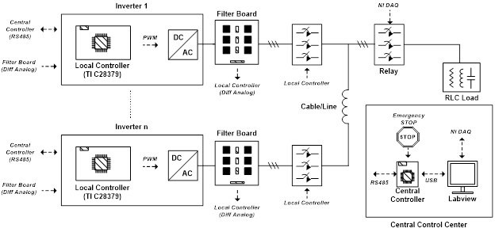

# MIT PicoGrid
The goal of this project is to develop controller firmware for inverter-based microgrids.

## Test-Bed Configuration
The system diagram of the "PicoGrid" looks like:

The system under construction:

## List of Components/Tools:

- TI C28379 microcontroller/TI CCS 6.0 IDE
- ST STEVAL-IHM028V2 2kW 3-phase IGBT inverters
- LabVIEW 14.0

## Team 
- Colm O'Rourke
- Matt Overlin

## Publications
- P. Vorobev; P. H. Huang, M. Al Hosani, J. L. Kirtley, and K. Turitsyn, “High-Fidelity Model Order Reduction for Microgrids Stability Assessment,” in IEEE Transactions on Power Systems, 2017 [[link](http://www.mit.edu/~turitsyn/assets/pubs/Vorobev2017ib.pdf)].
- P. Vorobev, P. H. Huang, M. Al Hosani, J. L.Kirtley, and K. Turitsyn, “Systematic Design of Virtual Component Method for Inverter-Based Microgrids,” 2017 IEEE 56th Annual Conference on Decision and Control (CDC),  Melbourne, VIC, Australia, 2017 [[link](http://www.mit.edu/~turitsyn/assets/pubs/Vorobev2017th.pdf)].
- P. H. Huang, P. Vorobev, M. Al Hosani, J. L.Kirtley, and K. Turitsyn, "Systematic Design of Virtual Component Method for Inverter-Based Microgrids," 2017 IEEE Power and Energy Society General Meeting (PESGM), Chicago, IL, 2017 [[link](http://www.mit.edu/~turitsyn/assets/pubs/Huang2017ve.pdf)].
